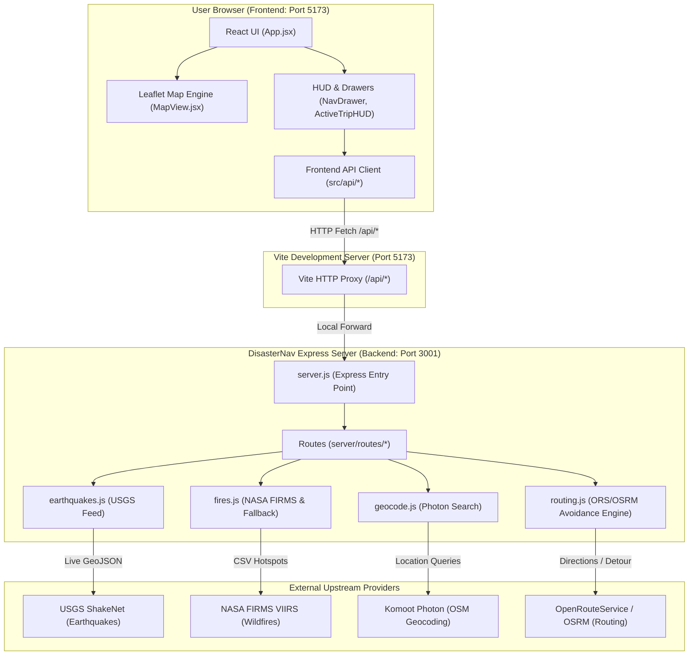

# DisasterNav Architecture Guide: Frontend vs. Backend

This guide explains how DisasterNav is structured, clearly distinguishing between the **Frontend** (`/client`) and the **Backend** (`/server`), how they communicate, and where specific features live.

---

## 🗺️ High-Level System Architecture



---

## ⚖️ Frontend vs. Backend: At a Glance

| Feature / Concern | Frontend (`/client`) | Backend (`/server`) |
|-------------------|----------------------|---------------------|
| **Core Technology** | React 18, Vite, Leaflet, Turf.js | Node.js, Express, Native Fetch |
| **Port** | `http://localhost:5173` | `http://localhost:3001` |
| **Primary Job** | Interactive visual UI, user clicks, drawing map vectors | Data proxying, API key security, caching, server-side detour routing |
| **Where it Runs** | In the user's web browser | On the local or cloud Node.js server |
| **API Keys** | **None** (never expose keys to the browser) | `FIRMS_API_KEY`, `ORS_API_KEY` stored in `.env` |
| **Data Sources** | Calls `/api/*` on Vite dev server | Calls USGS, NASA FIRMS, Photon, and ORS APIs |
| **Fallbacks** | Local mock data if network disconnected | Built-in realistic datasets if upstream APIs fail |

---

## 📁 1. Frontend Structure (`/client`)

```
client/
├── public/                 # Static assets, logos, icons
├── src/
│   ├── api/                # ⚡ FRONTEND API CLIENT LAYER (Calls backend proxy)
│   │   ├── earthquakes.js  # Sends fetch('/api/earthquakes')
│   │   ├── fires.js        # Sends fetch('/api/fires')
│   │   ├── floods.js       # Loads flood telemetry
│   │   ├── geocoding.js    # Sends fetch('/api/geocode?q=...')
│   │   ├── routing.js      # Sends fetch('/api/route', { start, end, avoid_polygons })
│   │   └── README.md       # Explains the client API layer
│   │
│   ├── components/         # 🎨 USER INTERFACE COMPONENTS
│   │   ├── ActiveTripHUD.jsx      # Navigation HUD overlay
│   │   ├── ActiveTripMarker.jsx   # Dynamic vehicle/user marker
│   │   ├── AlertSheet.jsx         # Bottom sliding alert tray
│   │   ├── DemoModal.jsx          # Admin hazard injection panel
│   │   ├── DetailModal.jsx        # Disaster details modal
│   │   ├── DisasterCycleLayer.jsx # Concentric hazard ripples & containment circles
│   │   ├── FilterChips.jsx        # Disaster layer visibility toggle chips
│   │   ├── GeospatialKey.jsx      # Symbology legend drawer
│   │   ├── MapView.jsx            # Interactive Leaflet map container
│   │   ├── NavDrawer.jsx          # Route planning sidebar & address search
│   │   ├── RouteLayer.jsx         # Leaflet polyline for active routes
│   │   ├── Sidebar.jsx            # Left navigation sidebar
│   │   ├── ToastNotification.jsx  # Notification popups
│   │   ├── TopBar.jsx             # Top status bar & sound toggle
│   │   └── UserLocationMarker.jsx # Live GPS location marker
│   │
│   ├── data/               # 📦 STATIC MOCK DATASETS
│   │   ├── mockEarthquakes.js
│   │   ├── mockFires.js
│   │   └── mockFloods.js
│   │
│   ├── utils/              # 🛠️ CLIENT HELPERS
│   │   ├── audio.js        # Web Audio API sound telemetry synthesizer
│   │   └── geometry.js     # Turf.js circular cycle buffers & line intersection
│   │
│   ├── App.css             # Component layout styles
│   ├── App.jsx             # Root React application coordinator & state management
│   ├── index.css           # Global CSS variables & design tokens
│   └── main.jsx            # React root mount point
│
├── index.html              # HTML template
├── package.json            # Frontend packages: React, Leaflet, Turf
├── vite.config.js          # Vite config & dev server reverse proxy
└── README.md               # Frontend guide
```

---

## 📁 2. Backend Structure (`/server`)

The backend is kept lean and hackathon-optimized into **4 self-contained route files**:

```
server/
├── routes/
│   ├── earthquakes.js      # GET  /api/earthquakes (USGS live alerts + cache)
│   ├── fires.js            # GET  /api/fires (NASA FIRMS hotspots + fallback)
│   ├── geocode.js          # GET  /api/geocode (Photon search + cache)
│   └── routing.js          # POST /api/route (ORS avoid_polygons + OSRM geometric detour)
├── .env                    # Secret API keys (ORS, FIRMS)
├── .env.example            # Environment template
├── package.json            # Backend packages: Express, Cors, Dotenv
├── README.md               # Backend guide
└── server.js               # Clean Express application entry point (mounts routes)
```

---

## 🔌 3. How Frontend and Backend Communicate

During local development:
1. **Frontend runs on**: `http://localhost:5173`
2. **Backend runs on**: `http://localhost:3001`

To prevent Cross-Origin Resource Sharing (CORS) issues and avoid hardcoding `http://localhost:3001` in client code, **Vite provides a reverse proxy** configured in `client/vite.config.js`:

```javascript
// client/vite.config.js
export default defineConfig({
  plugins: [react()],
  server: {
    port: 5173,
    proxy: {
      '/api': {
        target: 'http://localhost:3001',
        changeOrigin: true,
      },
    },
  },
});
```

### Request Flow Example:
1. User plans a trip in `client/src/components/NavDrawer.jsx`.
2. `client/src/api/routing.js` sends:
   ```javascript
   fetch('/api/route', {
     method: 'POST',
     body: JSON.stringify({ start, end, avoid_polygons })
   })
   ```
3. Vite proxies the request to `http://localhost:3001/api/route`.
4. `server/server.js` passes it to `server/routes/routing.js`.
5. The backend checks OpenRouteService or computes an intelligent detour around the hazard polygon.
6. The safe route is returned and painted in green by `client/src/components/RouteLayer.jsx`.

---

## 🏃 4. Running the Entire System

From the root directory:

```bash
# Run both Backend and Frontend simultaneously with live-reload:
npm run dev

# Or run them in separate terminals:
npm run dev:server    # Terminal 1: Starts Express on http://localhost:3001
npm run dev:client    # Terminal 2: Starts React on http://localhost:5173
```
